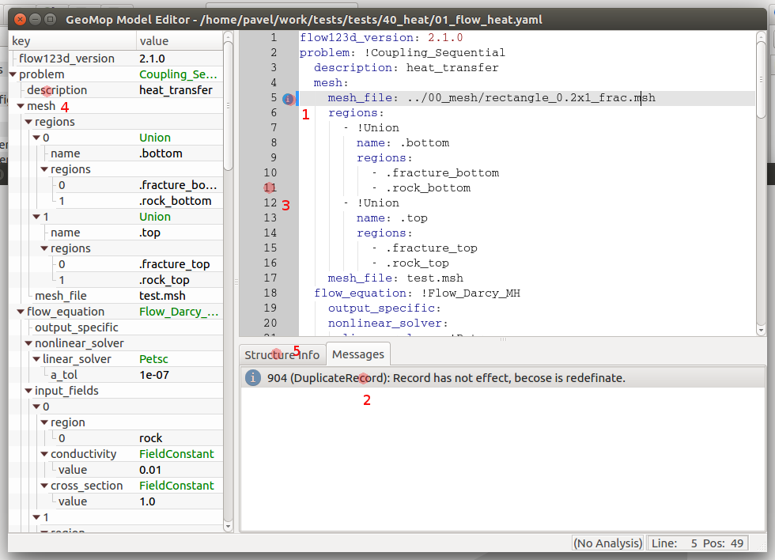
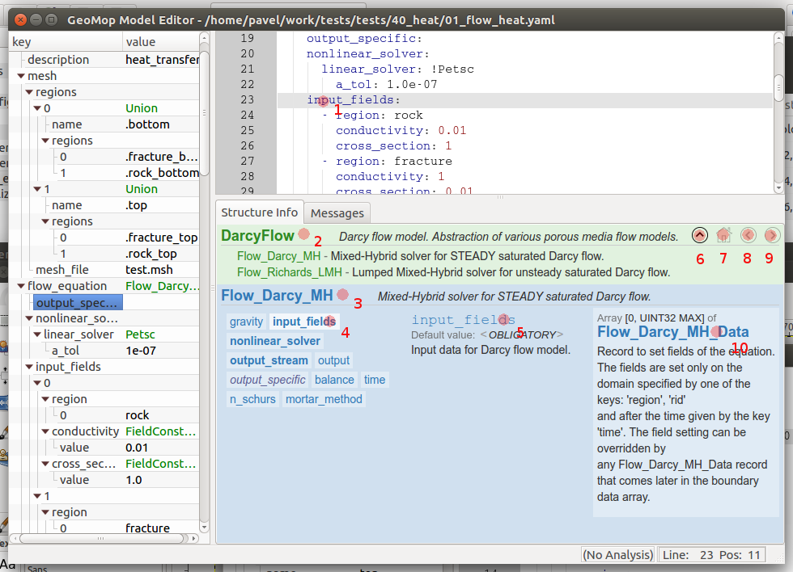

Model Editor Panels Description (czech) 
=======================================

Po otevření dokumentu se jeho obsah zobrazí v hlavním okně programu:

V levém panelu se zobrazí struktura dokumentu jako strom. Kliknutím na číslo řád ku v editoru (3) se ve stromu zvýrazní první element z tohoto řádku. Naopak kliknutím na daný element (4), nebo jeho hodnotu, dojde k vybrání příslušné oblasti v textovém editoru. 

Pokud dojde při validaci dokumentu k chybě, nebo k nejasnostem, je v panelu Messages pod textovým editorem zobrazen komentář. Komentáře jsou podle závažnosti rozděleny do tří kategorií:
  * fatal
  * error
  * warning
  * info
Fatalem je označena chyba, která zabránila validaci vědší části dokumentů.

Message je v textovém editoru označen odpovídající ikonkou a oblast ke které se chyba vztahuje pak barevnou čárou před dotčenými řádky. Kliknutím na ikonu (1) dojde k přepnutí na text chyby v panelu messages.

Místo panelu messages je možné zobrazit panel structure info, který zobrazuje informace o struktuře dokumentu:

Pokud je tento panel zapnutý, vztahuje se vždy k elementu na němž je textový kurzor (1). Pokud je kurzor na prázdném řádku, je zobrazována informace k elementu se stejným odsazením jako je pozice kurzoru.

V horní části structure info se zobrazuje informace o nadřazeném elementu (2) a jeho typu (3). V pravo je pak seznam hodnot (elementů), kterých může nadřazený element nabývat. Vybraný element je pak zvýrazněn svědlejším pozadím (4).
Tyto elementy jsou pak podle typu zobrazeny rozdílným typem a barvou písma:
  * tučně povinné položky
  * kurzívou volitelné
  * uzavřeny mez hvězdičky položky ke konverzy klíče
Po najedtí kurzoru nad element se typ elementu zobrazí i v bublinkové nápovědě.
V prostřední části structure info se pak zobrazuje informace k aktuálnímu elementu (5) a vlevo pak k typu hodnoty elementu (10)

Na některé položky, jako například na hodnatu typu elementu pokud je tato abstraktem, je možné kliknout a v okně zobrazit odpovídající nápovědu. K navigaci mezi takto zobrazenými okny slouží navigační panel umístěný vpravo nahoře. Tlačítkem domečku (7) se vždy dostanem zpět na výchozí element, na kterém je kurzor. Šipkou nahoru (6) pak o úroveň výše, podle struktury zobrazovaného dokumentu. Šipky (8) a (9) pak umožňují procházet historii.  

